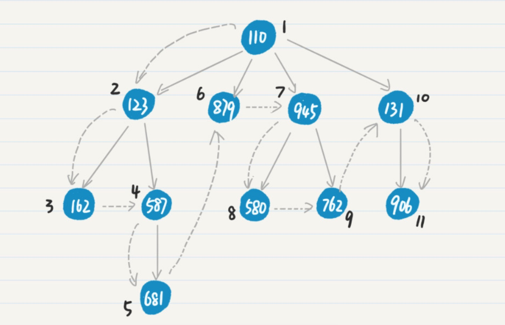

## 多叉树的深度优先搜索和广度优先搜索


基准测试结果：
```cassandraql
go test -bench=. -run=none
goos: darwin
goarch: amd64
pkg: tree
BenchmarkTree_BfsList-4         1000000000               0.000006 ns/op
BenchmarkTree_BfsArray-4        1000000000               0.000009 ns/op
BenchmarkTree_DfsArray-4        1000000000               0.000004 ns/op
BenchmarkTree_DfsList-4         1000000000               0.000003 ns/op
PASS
ok      tree        0.010s
```